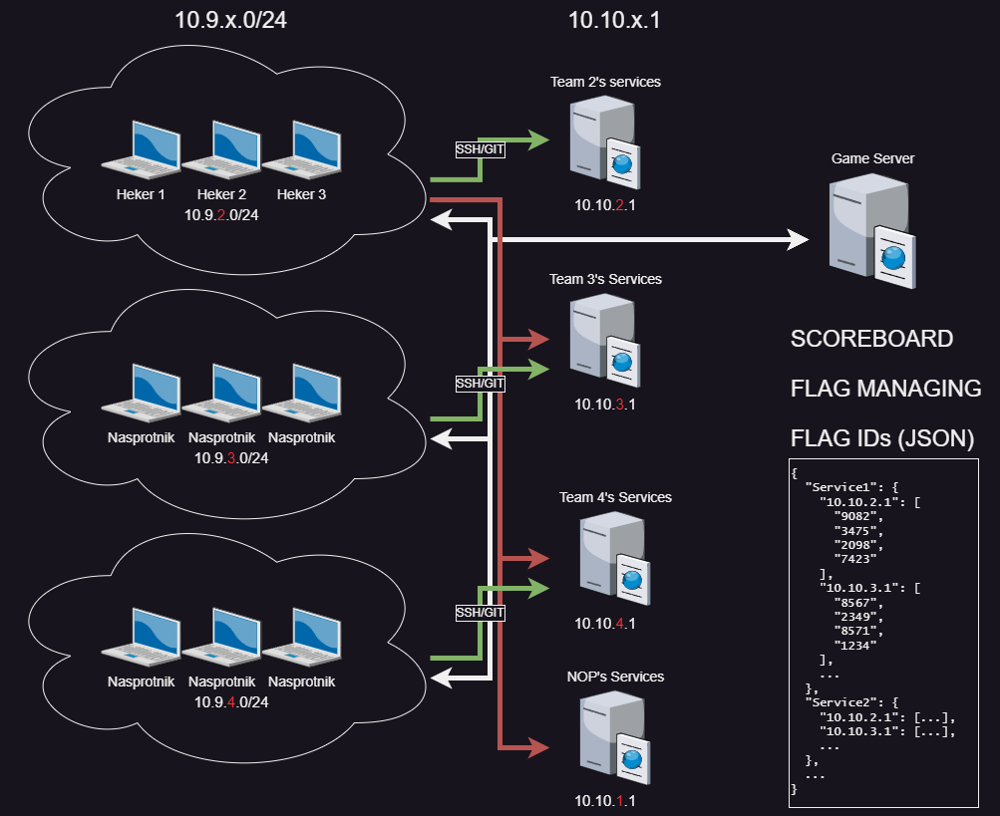
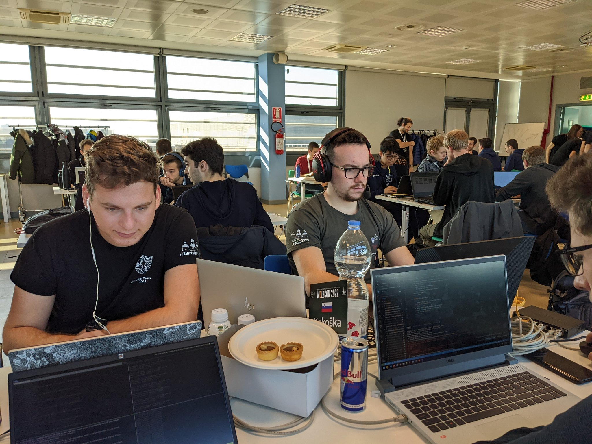

## Attack & Defense CTF

Aljaz Medic & Gasper Spagnolo

----

### What is AD CTF? <!-- .element: style="text-align: left; font-size: 41px;" -->
- Cybersecurity competition format
- Teams exploit vulnerabilities (attack)
- Teams protect their own systems (defense)
- Capture the Flag event
- Offensive: gain access to flags
- Defensive: patch vulnerabilities, monitor intrusions


----
<!-- .slide: style="text-align: left; font-size: 25px;" -->
### Example network structure <!-- .element: style="text-align: left; font-size: 40px;" -->
 <!-- .element style="border: 0; background: None; box-shadow: None;" width="80%" -->

----
<!-- .slide: style="text-align: left; font-size: 25px;" -->
### Usefull tools for AD/CTFs <!-- .element: style="text-align: left; font-size: 40px;" -->
- Nmap: network scanning and enumeration
- Wireshark: network traffic analysis
- Metasploit: exploitation and vulnerability assessment
- Burp Suite: web application security testing
- John the Ripper: password cracking
- Nikto: web server vulnerability scanning
- Ghidra: reverse engineering and disassembly
- sqlmap: SQL injection automation
- Aircrack-ng: wireless network security testing
- IDA Pro: binary analysis and reverse engineering
- Caronte: Network analysis tool ment for ADs
- Tulip: Network analysis tool ment for ADs
- Ataka: Automated serice for running exploits on ADs


----
<!-- .slide: style="text-align: left; font-size: 25px;" -->
### AD WORKFLOW ? <!-- .element: style="text-align: left; font-size: 40px;" -->

```bash
while true; do
    wget --recursive --no-clobber --no-parent --wait=5 --limit-rate=200k --convert-links\
    --random-wait --timestamping --level=1 --no-check-certificate --secure-protocol=auto\
    --https-only --user-agent="Mozilla/5.0 (Windows NT 10.0; Win64; x64) AppleWebKit/537.36 (KHTML, like Gecko) Chrome/58.0.3029.110 Safari/537.3"\
    --referer="https://www.example.com" --header="Accept: text/html,application/xhtml+xml,application/xml;q=0.9,image/webp,*/*;q=0.8"\
    --header="Accept-Language: en-US,en;q=0.5" --header="Accept-Encoding: gzip, deflate, br" \
    --header="Connection: keep-alive" --header="Upgrade-Insecure-Requests: 1" \
    --header="Pragma: no-cache" --header="Cache-Control: no-cache" --save-cookies cookies.txt \
    --load-cookies cookies.txt \
    -e robots=off -P ~/Downloads/pcap_files/ "https://www.example.com/sample.pcap"
done;
```

```python
while True:
    run_exploit()
```

Nope, we use tools such as **caronte/tulip** and **ataka** to help us out:).

----
<!-- .slide: style="text-align: left; font-size: 25px;" -->

### ADs where we participated <!-- .element: style="text-align: left; font-size: 40px;" -->
- ECSC AD CTF
- CYBERNIGHT AD CTF
- BAMBI CTF
- M0LECON CTF
- LOCKED SHIELDS 2023 (blue team)

 <!-- .element style="border: 0; background: None; box-shadow: None;" width="70%" -->
